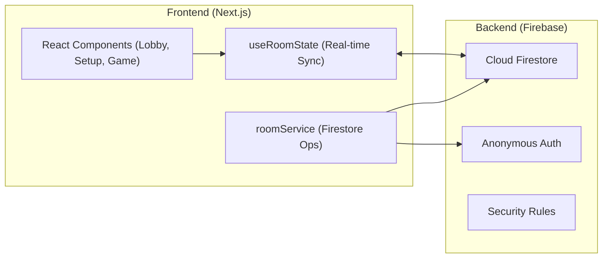

# 100 BINGO: Serverless Multiplayer Grid Battle

A real-time, competitive multiplayer Bingo game built with **Next.js 15 (App Router)** and **Firebase Firestore**. This project demonstrates a robust serverless state synchronization layer for low-latency gaming.

## 🏗️ System Architecture



### Key Technical Decisions
1. **Firestore-as-Source-of-Truth**: Replaced Socket.io with Firestore `onSnapshot` to handle state persistence and real-time synchronization without a dedicated Node.js server.
2. **Atomic Game Logic**: Every number selection uses **Firestore Transactions** to prevent race conditions during turn rotation.
3. **Headless TDD**: Core bingo win detection verified with Vitest prior to UI implementation.
4. **Premium Aesthetics**: Designed with a dark mode glassmorphism aesthetic, powered by Tailwind CSS and Framer Motion for smooth state transitions.

## 🚀 Features
- **Real-time Lobby**: Dynamic room listing and creation.
- **Strategic Setup**: Manual or random 5x5 board configuration.
- **Multiplayer Battle**: Turn-based selection with live marking across all clients.
- **Victory Detection**: Automatic bingo win detection with celebratory UI.
- **Host Migration**: Automatic host reassignment if the original creator leaves.

## 🛠️ Tech Stack
- **Framework**: Next.js 15 (App Router)
- **Language**: TypeScript
- **Styling**: Tailwind CSS
- **Animation**: Framer Motion
- **Backend/DB**: Firebase Firestore & Auth
- **Testing**: Vitest & React Testing Library

## 🚦 Getting Started

1. **Clone the repository**
2. **Install dependencies**:
   ```bash
   npm install
   ```
3. **Configure Environment**:
   Create a `.env.local` file with your Firebase credentials:
   ```env
   NEXT_PUBLIC_FIREBASE_API_KEY=xxx
   NEXT_PUBLIC_FIREBASE_AUTH_DOMAIN=xxx
   NEXT_PUBLIC_FIREBASE_PROJECT_ID=xxx
   NEXT_PUBLIC_FIREBASE_STORAGE_BUCKET=xxx
   NEXT_PUBLIC_FIREBASE_MESSAGING_SENDER_ID=xxx
   NEXT_PUBLIC_FIREBASE_APP_ID=xxx
   ```
4. **Deploy Security Rules**:
   Apply the rules from `firestore.rules` to your Firebase project.
5. **Run Development Server**:
   ```bash
   npm run dev
   ```

## 📜 Specifications
Detailed project specifications can be found in [docs/SPEC.md](./docs/SPEC.md).
Development guidelines and rules follow [project-rules.md](./project-rules.md).
